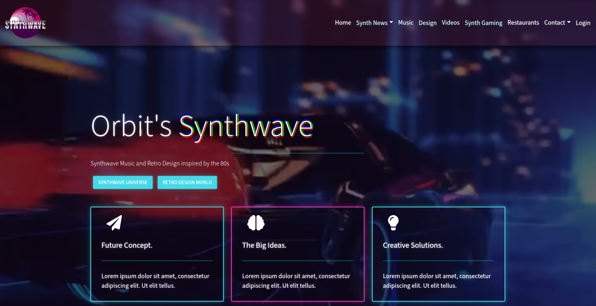
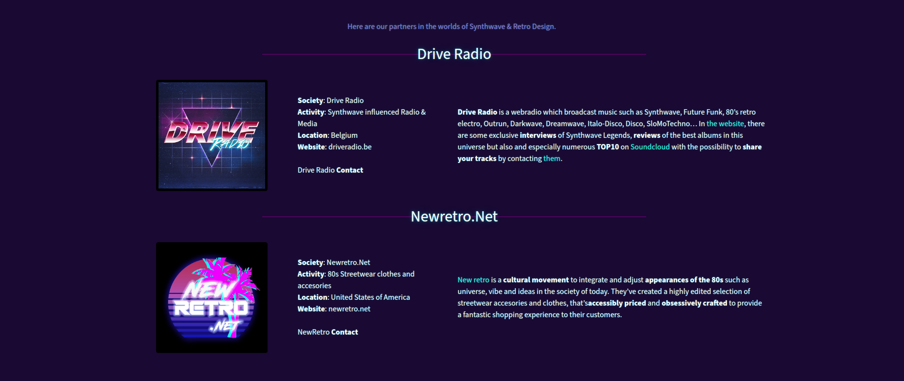

# Orbit's Synthwave

  

Orbit's Synthwave is a Retro Synthwave website replica created using the MERN (MongoDB, Express.js, React.js, Node.js) stack. It has a nostalgic vibes of the 80s with this sleek and stylish web application.

## Features

- **Retro Design**: Aesthetic user interface inspired by the Synthwave era.
- **MERN Stack**: Utilizes MongoDB for database, Express.js for backend, React.js for frontend, and Node.js for server.
- **Responsive**: Fully responsive design for a seamless experience across various devices.
- **[Add more features here]**

## Screenshots

